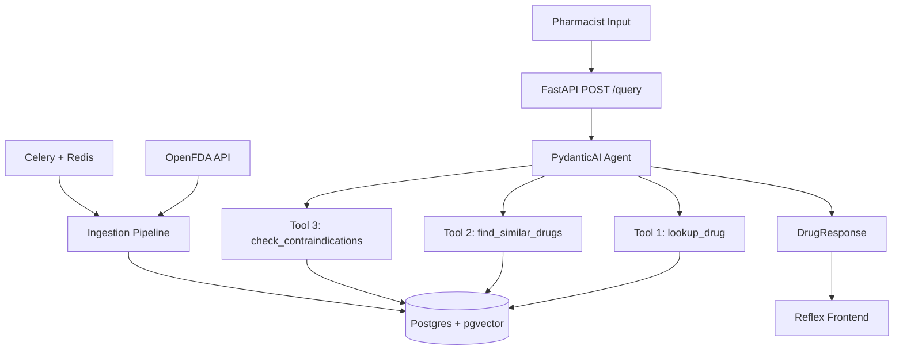

# PharmAI

Pharmacists deal with drug substitution decisions under time pressure. PharmAI is a RAG-powered clinical drug reference tool that takes a drug name and patient context — allergies, conditions — and returns the drug's profile, therapeutically similar alternatives, and contraindication flags grounded in real FDA label data. No hallucinated interactions. No invented dosages. Everything the agent says is sourced from retrieved text.

---

## Architecture



---

## Stack

| Layer | Technology |
|---|---|
| API | FastAPI |
| Agent | PydanticAI |
| LLM + Embeddings | Gemini 2.5 Flash Lite + gemini-embedding-001 |
| Vector Store | Postgres + pgvector |
| Task Queue | Celery + Redis |
| Data Source | OpenFDA Drug Label API |
| Frontend | Reflex |
| Infrastructure | Docker Compose |

---

## Run locally

```bash
cp .env.example .env        # add your GEMINI_API_KEY
docker compose up --build
curl http://localhost:8000/health
```

---

## Live demo

_Coming soon — link will be added post-deployment._

---

## Technical writeup

_Coming soon — link will be added on publication._

---

## Key design decisions

**Hybrid retrieval over pure semantic search** — semantic search alone misses exact drug name lookups. Lexical search alone misses therapeutic similarity. Reciprocal Rank Fusion combines both without requiring hand-tuned weights.

**pgvector over a dedicated vector database** — one less service to operate. Semantic search, lexical search, and relational queries all run in the same Postgres instance in the same transaction context.

**Fixed sequential tool calling** — the agent always runs lookup → similarity → contraindication check in that order. Clinical tools require auditable, deterministic behaviour. The agent does not plan; it executes.

**Evaluation as a first-class component** — retrieval precision@k and LLM-as-judge generation scoring are built in from the start. Confidence without measurement is a liability for a clinical tool.
