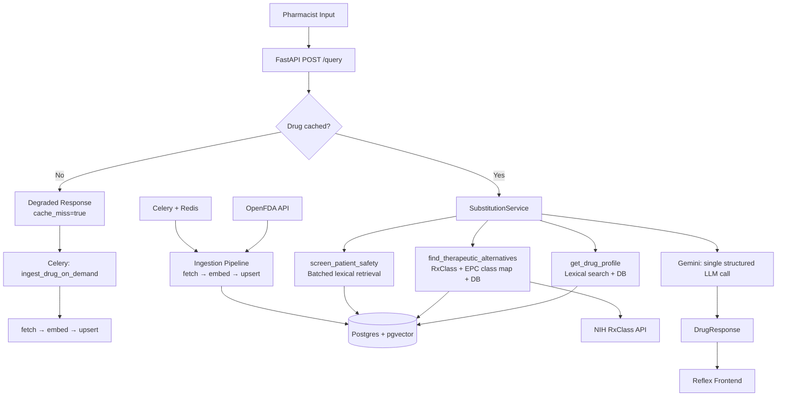

# PharmAI

Pharmacists make drug substitution decisions under time pressure with incomplete patient context. PharmAI is a clinical drug reference tool that takes a drug name and patient context — allergies, conditions — and returns the drug's profile, therapeutically safe alternatives, and contraindication flags grounded in real FDA label data.

No hallucinated interactions. No invented dosages. Every clinical statement is sourced from retrieved FDA label text.

---

## Architecture



---

## Stack

| Layer | Technology |
|---|---|
| API | FastAPI |
| Agent | PydanticAI |
| LLM | Gemini 2.5 Flash Lite |
| Vector Store | Postgres + pgvector |
| Task Queue | Celery + Redis |
| Drug Data | OpenFDA Drug Label API |
| Drug Class Data | NIH RxClass API |
| Observability | Logfire |
| Frontend | Reflex |
| Infrastructure | Docker Compose |

---

## Run locally

```bash
cp .env.example .env        # add GEMINI_API_KEY
docker compose up -d        # start Postgres and Redis
uv run uvicorn app.api.main:app --reload
```

---

## Key design decisions

**Separated deterministic clinical logic from probabilistic AI reasoning**
The architecture distinguishes between rules-based decisions (which drug classes are safe given a patient's allergies) and language model reasoning (summarising label text, explaining rationale). Class exclusion, candidate filtering, and contraindication retrieval all happen in deterministic Python services before the LLM is involved. The LLM does one thing: reason over pre-retrieved context and produce a structured response.

**Lexical retrieval over semantic search**
Every query in this system anchors on a known drug name or EPC class — there are no free-text similarity queries at runtime. Therapeutic alternative discovery is handled by structured RxClass lookups, not embedding similarity. Label chunk retrieval uses Postgres full-text search on explicit drug names (~20ms per call). Embeddings were evaluated and removed: the deterministic clinical logic made semantic similarity redundant.

**RxClass for therapeutic alternative discovery**
Rather than hand-authoring a drug class equivalence map, alternative classes are resolved at runtime via the NIH RxClass API — the same authoritative source the FDA uses. This avoids maintaining a clinical knowledge base while keeping substitution logic defensible.

**Cross-class alternative search**
The original design searched for alternatives only within the prescribed drug's EPC class. This is clinically wrong when a patient is allergic to that entire class. The redesigned `find_therapeutic_alternatives` resolves the patient's allergies to excluded EPC classes via RxClass, then searches safe alternative classes. A penicillin-allergic patient receives macrolide and fluoroquinolone alternatives, not more penicillins.

**Seed + cache-miss over full ingestion**
Full OpenFDA ingestion is expensive and noisy. A seed dataset of 19 EPC classes covers the majority of queries. Cache misses trigger on-demand background ingestion via a three-stage Celery chain (fetch → embed → upsert) with checkpoint files for crash recovery. The user receives a degraded response immediately while ingestion runs.

**pgvector over a dedicated vector database**
One less service to operate. Lexical search, fuzzy name matching, and relational queries all run in the same Postgres instance. The pgvector extension remains installed for potential future use.

**Evaluation as a first-class component**
Retrieval precision@k and LLM-as-judge generation scoring are built in from the start. For a clinical tool, confidence without measurement is a liability.

---

## Live demo

_Coming soon — link will be added post-deployment._

---

## Technical writeup

_Coming soon — link will be added on publication._
